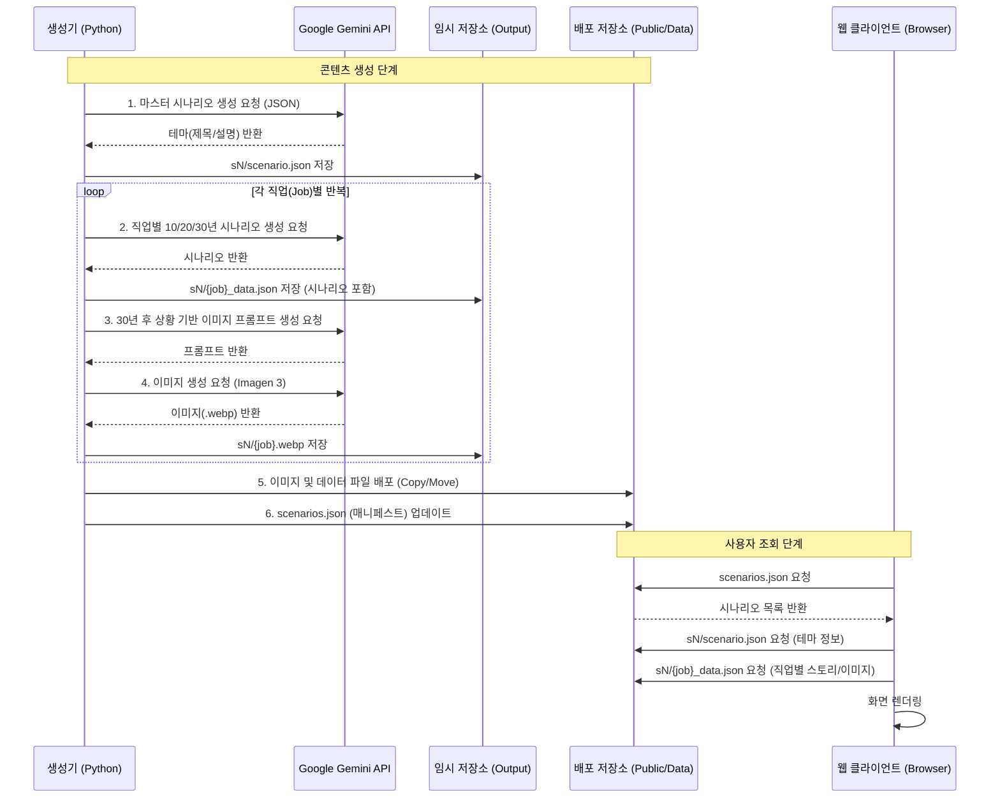

# 1Day1Doom (하루 한 번 멸망)

**"오늘, 당신의 일상은 어떻게 끝날까?"**

1Day1Doom은 매일(또는 사용자가 원할 때) 독특하고 유머러스한 "지구 종말" 시나리오를 예측해주는 웹 애플리케이션입니다. Google Gemini API를 사용하여 창의적인 멸망 서사를 생성하고, Imagen 3를 통해 각 직업군(Archetype)별로 생존하거나 적응하는 황당한 모습을 시각화합니다.

## 프로젝트 개요

이 프로젝트는 거대 언어 모델(LLM)과 이미지 생성 모델을 활용한 자동화된 콘텐츠 생성 파이프라인을 구축하는 실험적인 프로젝트입니다.

### 주요 특징

*   **다양한 멸망 테마**: 매번 새로운 주제(예: 인터넷 멸망, 좀비 아포칼립스, AI의 반란 등)로 시나리오가 생성됩니다.
*   **직업별 맞춤 생존기**: 회사원, 게이머, 부자, 학생 등 다양한 직업군이 10년, 20년, 30년 뒤 미래에 어떻게 적응(또는 멸망)하는지 보여줍니다.
*   **세분화된 생성 파이프라인**: 마스터 테마 생성 -> 직업별 스토리 생성 -> 이미지 프롬프트 추출 -> 이미지 생성의 다단계 과정을 거칩니다.
*   **자동화된 데이터 관리**: 생성된 콘텐츠는 JSON 및 WebP 이미지로 저장되어 웹 클라이언트에서 즉시 사용 가능합니다.

## 시스템 아키텍처

시스템은 크게 콘텐츠를 생성하는 `Batch Service`와 이를 사용자에게 보여주는 `Web Client`로 나뉩니다.



## 디렉토리 구조

```
1day1doom/
├── batch-service/          # 콘텐츠 생성 로직 (Python)
│   ├── generator.py        # 메인 생성 스크립트 (실행 파일)
│   ├── llm_client.py       # Google GenAI SDK 래퍼
│   ├── config.py           # 환경 설정 및 상수
│   ├── migrate_legacy.py   # 구 데이터 마이그레이션 도구
│   ├── output/             # 생성 결과물 임시 저장소 (Staging)
│   └── prompt/             # LLM 프롬프트 (JSON 형식)
│       ├── scenario.json       # 마스터 테마 생성용
│       ├── job_scenario.json   # 직업별 스토리 생성용
│       └── prompt_gen.json     # 이미지 프롬프트 생성용
├── docs/                   # 프론트엔드 애플리케이션 (GitHub Pages 배포)
│   ├── app.js              # 메인 로직 (데이터 로딩, UI 처리)
│   ├── index.html          # 메인 페이지
│   ├── style.css           # 스타일 시트
│   └── public/             # 정적 리소스 및 데이터
│       └── data/           # 생성된 시나리오 데이터 (s1, s2, ...)
└── README.md               # 프로젝트 문서
```

## 설치 및 실행 방법

### 사전 요구 사항

*   Python 3.8 이상
*   Google Gemini API Key (AI Studio에서 발급)

### 1. 배치 생성기 실행 (새로운 멸망 시나리오 만들기)

`batch-service` 폴더에서 작업을 수행합니다.

1.  **의존성 설치**:
    ```bash
    cd batch-service
    pip install google-genai python-dotenv
    ```

2.  **환경 변수 설정**:
    `.env` 파일을 생성하고 API 키를 입력합니다.
    ```ini
    GEMINI_API_KEY=your_api_key_here
    ```

3.  **생성기 실행**:
    ```bash
    python generator.py
    ```
    *   실행 시 `batch-service/output/s{N}/` 폴더에 생성 결과물이 저장됩니다.
    *   생성이 완료되면 자동으로 `docs/public/data/s{N}/`으로 필요한 파일이 복사/이동됩니다.

### 2. 웹 클라이언트 실행 (결과 확인하기)

`docs` 폴더는 정적 웹사이트이므로 별도의 백엔드 서버 없이 브라우저에서 바로 열거나 로컬 서버를 띄워 확인할 수 있습니다.

1.  **로컬 서버 실행** (Python 이용 예시):
    ```bash
    cd docs
    python -m http.server 8000
    # 또는
    npx serve .
    ```

2.  **브라우저 접속**:
    `http://localhost:8000`으로 접속하여 오늘의 멸망 시나리오를 확인하세요.

## 프롬프트 작성 가이드

이 프로젝트의 프롬프트는 `batch-service/prompt/` 폴더 내에 **JSON 형식**으로 관리됩니다. 각 파일은 시스템 프롬프트(`systemPromopt`)와 사용자 프롬프트(`userPromopt`)로 명확히 구분되어 있습니다.

*   `scenario.json`: **[Role]** B급 예언가 페르소나가 정의되어 있으며, 오늘의 멸망 테마를 생성합니다.
*   `job_scenario.json`: **[Task]** 특정 직업군 생존자의 10/20/30년 후 이야기를 생성합니다.
*   `prompt_gen.json`: **[Style]** 30년 후 상황을 기반으로 이미지 생성용 영문 묘사를 생성합니다.

## 라이선스

이 프로젝트는 오픈 소스입니다.
