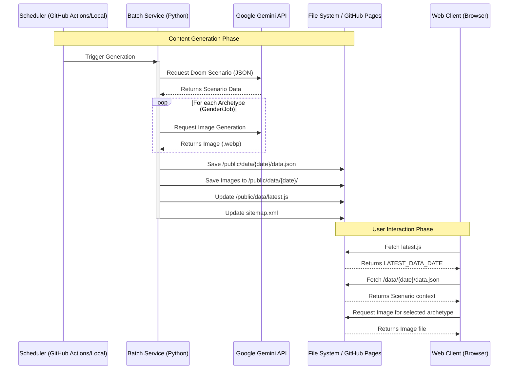

# 1Day1Doom (One Day One Doom)

**"Your Daily Dose of Dystopia."**

1Day1Doom is a web application that generates a unique, humorous, and creative "end of the world" scenario every day (or week). It uses Google's Gemini API to create detailed narratives and Imagen to generate corresponding visual representations for various survivor archetypes.

## Project Structure

The project consists of two main components:

1.  **Batch Service (`/batch-service`)**: A Python-based backend that runs periodically to generate new content.
2.  **Web Client (`/web-client`)**: A static frontend that displays the generated scenarios to users.

## System Architecture

The following diagram illustrates how the system generates and serves content.



## Directory Structure

```
1day1doom/
├── batch-service/          # Content Generation Logic
│   ├── generator.py        # Main entry point for generation
│   ├── llm_client.py       # Wrapper for Google GenAI SDK
│   ├── config.py           # Configuration constants
│   └── prompt/             # Prompt templates for LLM
├── web-client/             # Frontend Application
│   ├── app.js              # Application logic
│   ├── index.html          # Main entry HTML
│   ├── style.css           # Styling
│   └── public/             # Static Assets & Generated Data
│       └── data/           # Storage for generated dates
└── README.md               # Project Documentation
```

## Setup & Usage

### Prerequisites

-   Python 3.8+
-   Google Gemini API Key

### Running the Batch Generator

1.  Navigate to `batch-service`:
    ```bash
    cd batch-service
    ```
2.  Install dependencies (if `requirements.txt` exists, otherwise install `google-genai`, `python-dotenv`):
    ```bash
    pip install google-genai python-dotenv
    ```
3.  Set your API Key in `.env`:
    ```ini
    GEMINI_API_KEY=your_api_key_here
    ```
4.  Run the generator:
    ```bash
    python generator.py
    ```
    This will create a new folder in `web-client/public/data/{YYYY-Www}` with the generated content.

### Running the Web Client

Since the client is static, you can serve it with any static file server.

1.  Navigate to `web-client`:
    ```bash
    cd web-client
    ```
2.  Start a local server (e.g., using Python):
    ```bash
    python -m http.server 8000
    ```
3.  Open `http://localhost:8000` in your browser.

## License

This project is open source.
